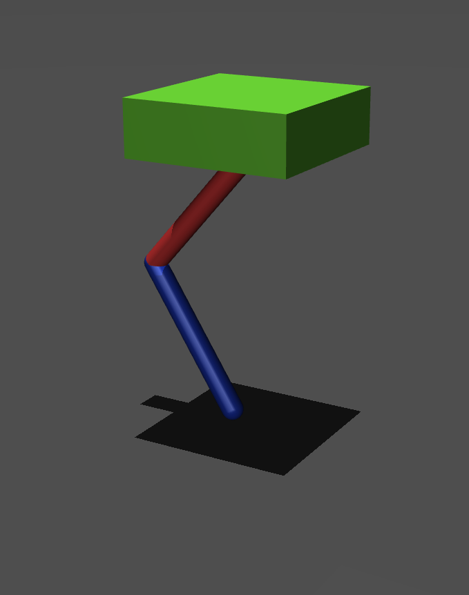

Summer Internship, U R Rao Satellite Centre (ISRO) | Summer 2026

Most legged robots are designed the same way: fix the mechanical design first, then build a controller to work with them. This project explores what happens when you flip that — treating a robot's physical proportions, motion trajectory, and control policy as coupled variables optimized together, rather than in the conventional sequence.

The setup: A two-link monoped (single-legged hopping robot) built to jump 0.2 m under lunar gravity (1.625 m/s²), with thigh and shank link lengths as the free design parameters. Two different controllers were built to drive the jump — a real-time Quadratic Programming (QP) task-space controller, and a trajectory optimizer (CasADi + IPOPT) that plans the entire stance-phase motion in advance to minimize actuator work.

The framework: A bi-level optimization — an outer Differential Evolution search (via PyGMO) proposes candidate link lengths, and for each candidate an inner loop simulates the jump in MuJoCo and reports back the Cost of Transport (COT), the metric DE tries to minimize.

Key findings:

Both controllers converged to nearly identical optimal morphologies independently, suggesting the task itself — not the controller — dominates which body proportions are efficient.
The trajectory optimizer consistently beat the QP controller in energy efficiency (COT 1.35 vs 1.61), since it can plan effort distribution across the whole stance phase rather than reacting greedily.
Each morphology performed best paired with the controller it was co-designed with — direct evidence that link geometry, trajectory, and control aren't separable design choices.

A separate 5-DOF extension (adding base pitch and horizontal translation) was also built to generate stable, self-righting 2D jumps, laying groundwork for a future quadruped co-design study targeting low-gravity locomotion.

Tools: Python, MuJoCo, CasADi, IPOPT, PyGMO, OSQP

<figure>
  
  <figcaption>Model Model built in MujoCo</figcaption>
</figure>

