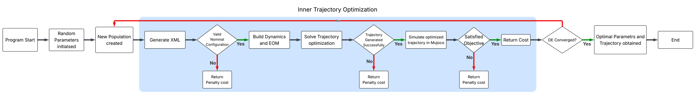

**Summer Internship, U R Rao Satellite Centre (ISRO) - Summer 2026**

Most legged robots get designed the same way: fix the mechanical
design first, then build a controller to work with it. This project
flips that order, treating a robot's physical proportions, motion
trajectory, and control policy as coupled variables optimized
together rather than in the usual sequence.

## The Setup

A two-link monoped (single-legged hopping robot) built to jump 0.2 m
under lunar gravity (1.625 m/s²), with thigh and shank link lengths
as the free design parameters. Two different controllers drove the
jump: a real-time Quadratic Programming (QP) task-space controller,
and a trajectory optimizer (CasADi + IPOPT) that plans the entire
stance-phase motion in advance to minimize actuator work.



## The Framework

A bi-level optimization: an outer Differential Evolution search
(via PyGMO) proposes candidate link lengths, and for each candidate
an inner loop simulates the jump in MuJoCo and reports back the
Cost of Transport (COT), which DE tries to minimize.

## Key Findings

- Both controllers converged to nearly identical optimal
  morphologies independently. That suggests the task itself, not the
  controller, dominates which body proportions are efficient.
- The trajectory optimizer consistently beat the QP controller in
  energy efficiency (COT 1.35 vs 1.61), since it can plan effort
  distribution across the whole stance phase instead of reacting
  greedily.
- Each morphology performed best when paired with the controller it
  was co-designed with. Link geometry, trajectory, and control
  aren't separable design choices.

A separate 5-DOF extension (adding base pitch and horizontal
translation) was also built to generate stable, self-righting 2D
jumps, laying groundwork for a future quadruped co-design study
targeting low-gravity locomotion.

**Tools:** Python, MuJoCo, CasADi, IPOPT, PyGMO, OSQP



