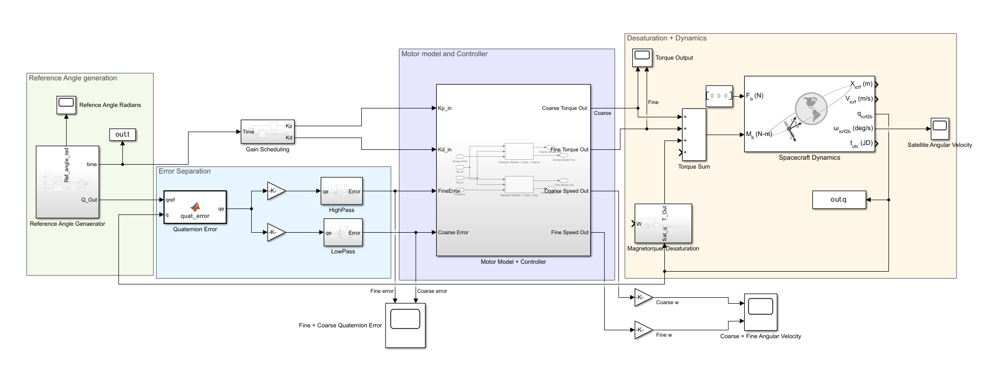

**Role:** ADCS Team Member, Small Spacecraft Systems and Payload Centre, IIST
 
A satellite's attitude control stack is usually treated as three separate problems: damp the initial tumble, point somewhere useful, then track a target while moving. This work built and tested all three stages for InspireSat-3, a student-built CubeSat in a 500 km Sun-Synchronous Orbit, using magnetorquers for detumbling and reaction wheels for pointing and ground-station tracking.

## Detumbling: B-dot control
 
A Simulink model implementing the B-dot control law drove a 31.25 cm cube satellite (moment of inertia [3, 3, 10] kg·m², magnetorquers capped at 5 A·m²) from an initial 10°/s tumble back to rest. The orbit (500 km, 97.5° inclination) was generated first, with the local magnetic field modeled using IGRF.
 
Settling time depended heavily on which axis the satellite was tumbling about. The lower-inertia axis settled in about 58 minutes; the higher-inertia axis took roughly 400 minutes, nearly seven times longer. That gap says the initial spin axis, not just the control law, sets how long detumbling takes.
 
## Pointing and tracking: reaction wheel control
 
A full 6-DOF satellite dynamics and quaternion kinematics model, driven by a PID controller commanding reaction wheel torque through a closed-loop motor transfer function, handled four ground-station pass maneuvers: limb pointing, limb-to-GS transition, GS tracking, and GS-to-limb transition, with reference angles generated from orbit time. Results were checked against Simulink Satellite Viewer using a 30° field-of-view sensor cone over the same 97.5°, 500 km SSO.



A later iteration added reaction wheel desaturation logic and made the reference-angle generation block parametric, so mission timing can change without touching the controller itself.

## Trajectory smoothing
 
The original reference trajectory was continuous but not differentiable at the maneuver transitions. That non-smoothness resulted in  discontinuous angular velocity commands and large torque spikes right at each transition, exactly where the controller needed to be smoothest. Redesigning the transition function for first-order smoothness between limb-pointing and GS-tracking segments removed the spikes, cut oscillations, reduced power consumption and tightened tracking accuracy, confirmed by comparing angle and angular-velocity profiles before and after the change.
 
**Tools:** MATLAB, Simulink, Simulink Satellite Viewer

---
*Part of ongoing ADCS development at SSPACE, building out a control stack from detumbling through precision ground-station tracking for CubeSat operations.*